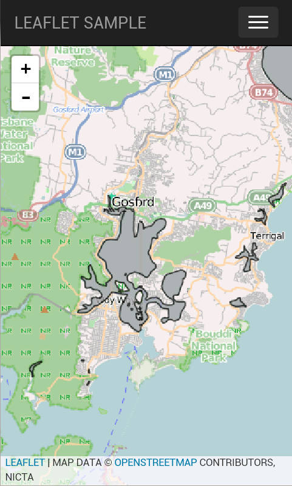

# Leaflet Project Template

### Introduction

This is a [Cordova 3.2](http://cordova.apache.org/) template project using the following javascript libraries...
* [Leaflet](http://leafletjs.com/)
* [Bootstrap](http://getbootstrap.com/)
* [Angular JS](http://angularjs.org/)
* [jQuery](http://jquery.com/)

### Get up and running

#### Build Environment

* [Node](http://nodejs.org/) (required for Cordova CLI)
* [Android SDK](http://developer.android.com/sdk/index.html)
* [Cordova CLI](http://cordova.apache.org/docs/en/3.2.0/guide_cli_index.md.html#The%20Command-Line%20Interface)

#### Install

Create a new Cordova CLI project

    cordova create cordova-leaflet
    cd cordova-leaflet
    
    # Install the android platform
    cordova platform add android

    # Install the geolocation plugin
    cordova plugin add org.apache.cordova.geolocation

    # Back up the default www dir
    mv www www-bak
    
    # Clone the repo as the www dir
    git clone git@github.com:NICTA/fsdf-hackfest-cordova-leaflet.git www
    
    # Run/debug locally in a browser
    google-chrome www/index.html
    
    # Run on device
    cordova run android
    
    # Run on emulator
    cordova emulate android

